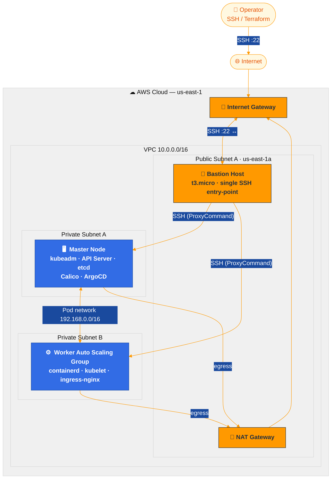

# Kubernetes on AWS — Terraform + Ansible + GitOps

**A production-shaped Kubernetes platform built from raw EC2 instances, not a managed service.** Infrastructure, cluster bootstrap, ingress, GitOps continuous delivery, and observability — provisioned and reconciled entirely through code.


---

## Why this exists

Managed Kubernetes (EKS, GKE) hides almost everything worth understanding: how `kubeadm init` actually forms a control plane, how a CNI wires pod networking together, how a GitOps controller reconciles cluster state against Git. This project builds that stack **by hand**, on a deliberately minimal-permission AWS account (no IAM roles, no load balancers, no managed add-ons) — the same kind of constraints you hit in a real cost-conscious or access-restricted environment.

**What it demonstrates:**

- ✅ **Infrastructure as Code** — full AWS network + compute topology in modular Terraform (VPC, security groups, bastion, ASG)
- ✅ **Cluster bootstrapping from scratch** — `kubeadm init`/`join`, containerd, Calico CNI, all via idempotent Ansible roles
- ✅ **GitOps continuous delivery** — ArgoCD reconciling workloads from a separate Git repo, self-healing on drift
- ✅ **Observability** — Prometheus + Grafana, right-sized for the cluster's actual capacity, deployed *through* the GitOps pipeline
- ✅ **Real operational hardening** — every bug below was hit and fixed against a live AWS deployment, not simulated

## Architecture



No load balancer, no public API endpoint — everything is reached through the bastion, exactly like a locked-down real-world environment would require.

## GitOps flow

Once bootstrapped, **nothing is deployed by hand.** ArgoCD watches a separate manifests repo ([`k8s-gitops`](https://github.com/ghassenkhalfallah/k8s-gitops)) and continuously reconciles the cluster to match it — push a manifest, ArgoCD applies it; edit something in-cluster manually, ArgoCD reverts it.


Full write-up: [`docs/gitops.md`](docs/gitops.md)

## Tech stack

| Layer          | Choice                                    |
|----------------|--------------------------------------------|
| Cloud           | AWS (us-east-1, 2 AZs)                     |
| IaC             | Terraform 1.5+ (modular: vpc / security / compute) |
| Config mgmt     | Ansible 2.14+ (5 idempotent roles)         |
| OS              | Ubuntu 22.04 LTS                            |
| Container runtime | containerd 2.2 (SystemdCgroup, v3 config schema) |
| CNI             | Calico v3.27 (VXLAN)                        |
| Bootstrap       | kubeadm, Kubernetes 1.29                    |
| Ingress         | NGINX Ingress Controller (Helm, NodePort)   |
| GitOps          | ArgoCD 10.3 (app-of-apps, auto-sync + self-heal) |
| Observability   | kube-prometheus-stack (Prometheus + Grafana), path-routed through the existing Ingress |

## Quick start

```bash
# 1. Credentials + prereqs
source scripts/load-env.sh
bash scripts/check-prereqs.sh

# 2. Provision infrastructure
cd terraform
terraform init
terraform plan -out=tfplan && terraform apply tfplan

# 3. Bootstrap the cluster (kubeadm, Calico, Ingress, ArgoCD — all 5 plays)
cd ../ansible
ansible-playbook -i inventory/hosts.ini site.yml

# 4. Verify
ssh -i ../terraform/k8s-cluster.pem -o ProxyCommand="ssh -i ../terraform/k8s-cluster.pem -W %h:%p ubuntu@$(terraform -chdir=../terraform output -raw bastion_public_ip)" ubuntu@<master-ip> 'kubectl get nodes'
```

Full step-by-step walkthrough, including every Ansible concept explained: **[`docs/walkthrough.md`](docs/walkthrough.md)**

### Scaling workers

```bash
# edit worker_count in terraform.tfvars, then:
terraform apply
ansible-playbook -i inventory/hosts.ini site.yml   # idempotent, only the new node changes anything
```

## Repository layout

```
k8s-cluster/
├── terraform/
│   ├── main.tf, variables.tf, outputs.tf
│   └── modules/{vpc, security, compute}/
├── ansible/
│   ├── site.yml                5 plays: common → master → worker → ingress → gitops
│   ├── group_vars/all.yml      every version pin, one place
│   └── roles/
│       ├── common/             swap off, kernel modules, containerd, kubeadm
│       ├── master/              kubeadm init, Calico CNI, join-command generation
│       ├── worker/              kubeadm join (idempotent)
│       ├── ingress/             NGINX Ingress Controller (Helm)
│       └── gitops/              ArgoCD (Helm) + bootstrap Application
├── docs/
│   ├── walkthrough.md          full play-by-play + Ansible concepts primer
│   ├── gitops.md                what GitOps replaced, the new day-2 workflow
│   ├── roadmap.md               what's done, what's next
│   └── diagrams/                Mermaid + PlantUML architecture diagrams
└── scripts/                    env loading + prereq checks (bash + PowerShell)
```

The workload manifests ArgoCD deploys live in a **separate** repo: [`k8s-gitops`](https://github.com/ghassenkhalfallah/k8s-gitops) — kept apart on purpose, mirroring a real infra-repo-vs-app-repo split.

## Roadmap

Tier 1 (production awareness) is 3/4 complete — see **[`docs/roadmap.md`](docs/roadmap.md)** for the full tiered list, including what's planned next (remote Terraform state, CI/CD, HA control plane, network policies).

## Security notes

- Workers and masters sit in **private subnets** — no public IPs, no direct internet exposure.
- The bastion is the **only** SSH entry point; `ssh_allowed_cidr` should be locked to your IP for anything beyond a lab.
- No IAM roles/instance profiles — deliberately minimal for restricted-permission AWS accounts.
- SSH key is generated fresh by Terraform (`tls_private_key`), marked `sensitive`, never committed.

## License

MIT
