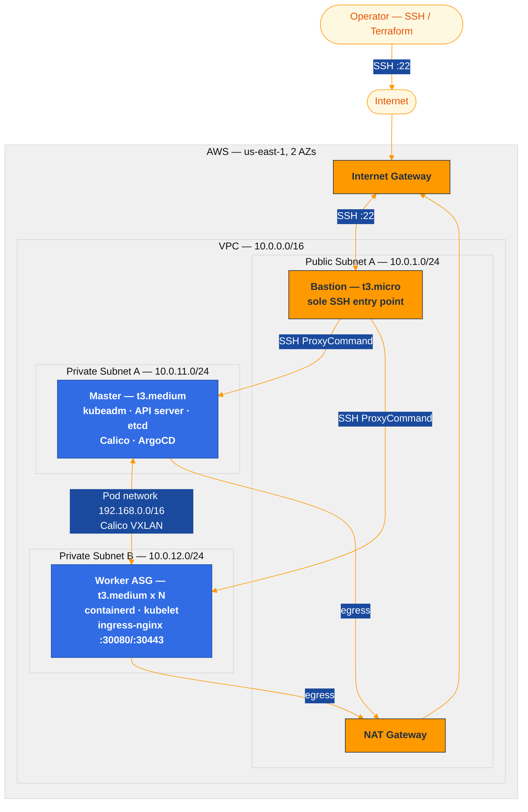
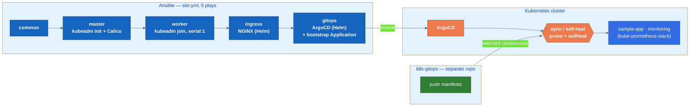

# Kubernetes on AWS — from `kubeadm init` to GitOps, no managed services

A Kubernetes platform built on raw EC2 instances instead of EKS: Terraform provisions the network and compute, Ansible bootstraps the cluster with `kubeadm`, and ArgoCD takes over from there, reconciling everything that runs on top of it from a separate Git repo. No load balancer, no IAM roles, no managed control plane — built and debugged against a real, minimal-permission AWS account, which surfaces a different (and more instructive) set of problems than `eksctl create cluster` ever will.


---

## Why build this by hand

EKS and GKE are the right call for production — but they also hide every part of Kubernetes that's actually worth understanding: what `kubeadm init` does to stand up etcd and the API server, how a CNI actually wires pod-to-pod routing, why kube-proxy matters, what a GitOps controller's reconcile loop looks like when it's *your* cluster drifting. This project does all of that manually, on an AWS account with deliberately restricted permissions (no IAM roles/instance profiles, no NLB, single NAT gateway) — constraints that mirror a real cost-conscious or access-locked-down environment far more than a "click deploy" tutorial does.

The result: a single-master cluster (HA-capable — `master_count` supports 1 or 3), reached exclusively through a bastion, running its own CNI, ingress controller, GitOps controller, and monitoring stack, with every layer defined as code.

## Architecture



No public API endpoint, no load balancer — every SSH hop and every `kubectl` command routes through the bastion. More diagrams (network flows, deployment sequence, per-node component breakdown, scaling) live in [`docs/diagrams/`](docs/diagrams/).

## Real problems solved

The value here isn't that this works — plenty of tutorials work. It's that this was built and rebuilt against a live AWS account, and here's what broke and why:

**containerd's apt package jumped major versions mid-project, breaking the pin.** `containerd_version` was pinned to `1.7.*`; a later `apt install` failed because Ubuntu's repo had moved on to `2.2.1` and `1.7.*` was no longer resolvable. Re-pinning to `2.2.*` wasn't enough on its own — containerd 2.x deprecates the old config schema, so `containerd-config.toml` had to be migrated from `version = 2` / `[plugins."io.containerd.grpc.v1.cri"]` to `version = 3` with the CRI config split across `[plugins.'io.containerd.cri.v1.images']` and `[plugins.'io.containerd.cri.v1.runtime']`. Get this wrong and containerd starts but kubelet can't create pod sandboxes.

**Fresh EC2 boots race `unattended-upgrades` for the dpkg lock.** First-run bootstraps intermittently failed on the very first `apt` task because cloud-init's automatic security updates were still holding `/var/lib/dpkg/lock-frontend`. Fixed by adding a wait-loop (`while fuser /var/lib/dpkg/lock-frontend; do sleep 5; done`) as the first task in the `common` role, before any package operation runs.

**`terraform apply` silently stopped scaling the worker pool.** The worker `aws_autoscaling_group` had `lifecycle { ignore_changes = [desired_capacity] }` — originally there to stop Terraform fighting the ASG over instance churn, but it also meant the documented "bump `worker_count`, `terraform apply`" workflow did nothing at all. No error, no diff, just a `desired_capacity` that never moved. Removing the lifecycle block fixed the scaling path; verified by actually scaling the pool up and down.

**ArgoCD's directory source doesn't recurse by default.** The bootstrap root `Application` pointed `source.path` at `apps/` in the separate `k8s-gitops` repo, expecting it to pick up everything underneath — `apps/sample-app/`, `apps/monitoring/`, etc. Without `directory.recurse: true`, ArgoCD only scans the exact path given, so it reported `Synced` / `Healthy` while managing precisely zero resources. Easy to miss because nothing *fails* — the sync just quietly does nothing.

**Grafana behind a path-based Ingress hit an infinite redirect loop, then a broken redirect.** Two separate bugs stacked here: first, combining an nginx `rewrite-target: /$2` annotation with Grafana's `serve_from_sub_path: true` meant both the ingress and Grafana itself were rewriting the path, which redirect-looped the browser. Fix: drop the rewrite annotation and let a plain `/grafana` prefix pass straight through, since `serve_from_sub_path` expects the prefix intact. Second, Grafana's `root_url` used the `%(domain)s:%(http_port)s` template variables, which resolved to the pod's own internal address instead of the actual bastion-tunneled URL — fixed by hardcoding `root_url` to the real external address (`http://localhost:30080/grafana/`).

## GitOps flow

Once bootstrapped, nothing runs on the cluster by hand. ArgoCD watches a separate manifests repo — [`k8s-gitops`](https://github.com/ghassenkhalfallah/k8s-gitops) — and continuously reconciles the cluster to match it: push a manifest, ArgoCD applies it; edit something in-cluster directly, `selfHeal` reverts it.



Monitoring (`kube-prometheus-stack` 88.3.0) is deployed as an ArgoCD app-of-apps child, not more Ansible — and it's deliberately right-sized for a lab cluster with no dynamic storage provisioner: Alertmanager and the kubeadm-only component monitors (`kubeControllerManager`/`kubeScheduler`/`kubeEtcd`/`kubeProxy` — these bind to `127.0.0.1` under kubeadm and would just report permanently down) are disabled, Prometheus runs on a capped 2Gi `emptyDir` with 24h retention instead of a PersistentVolume, and every component carries explicit resource requests/limits.

Full write-up, including the ArgoCD access flow and initial-admin-password retrieval: [`docs/gitops.md`](docs/gitops.md).

## Tech stack

| Layer              | Choice                                                          |
|--------------------|------------------------------------------------------------------|
| Cloud              | AWS, us-east-1, 2 AZs                                            |
| IaC                | Terraform ≥1.5 (modular: `vpc` / `security` / `compute`)         |
| Config management  | Ansible, 5 idempotent roles (`common`, `master`, `worker`, `ingress`, `gitops`) |
| OS                 | Ubuntu 22.04 LTS                                                  |
| Container runtime  | containerd `2.2.*`, `SystemdCgroup=true`, v3 config schema        |
| CNI                | Calico v3.27.0 (VXLAN mode), pod CIDR `192.168.0.0/16`            |
| Bootstrap          | kubeadm, Kubernetes 1.29, service CIDR `10.96.0.0/12`             |
| Ingress            | NGINX Ingress Controller 4.12.0 (Helm), NodePort 30080/30443       |
| GitOps             | ArgoCD 10.3.3 (Helm), app-of-apps, `prune` + `selfHeal`           |
| Observability      | kube-prometheus-stack 88.3.0 (Prometheus + Grafana), path-routed through the existing Ingress |

## Quick start

```bash
# 1. Credentials + prereqs
source scripts/load-env.sh
bash scripts/check-prereqs.sh

# 2. Provision infrastructure
cd terraform
terraform init
terraform plan -out=tfplan && terraform apply tfplan

# 3. Bootstrap the cluster — kubeadm, Calico, Ingress, ArgoCD (all 5 plays)
cd ../ansible
ansible-playbook -i inventory/hosts.ini site.yml

# 4. Reach the cluster through the bastion
bash ../scripts/ssh-master.sh   # or the ssh_to_bastion / kubeconfig_command terraform outputs
```

Full step-by-step walkthrough, including every Ansible concept explained: **[`docs/walkthrough.md`](docs/walkthrough.md)**.

### Scaling workers

```bash
# edit worker_count in terraform.tfvars, then:
terraform apply
ansible-playbook -i inventory/hosts.ini site.yml   # idempotent — only the new node changes anything
```

## Repository layout

```
k8s-cluster/
├── terraform/
│   ├── main.tf, variables.tf, outputs.tf
│   └── modules/{vpc, security, compute}/
├── ansible/
│   ├── site.yml                5 plays: common → master → worker → ingress → gitops
│   ├── group_vars/all.yml      every version pin, one place
│   └── roles/
│       ├── common/             swap off, kernel modules, dpkg-lock wait, containerd, kubeadm
│       ├── master/              kubeadm init, Calico CNI, join-command generation
│       ├── worker/               kubeadm join (idempotent, serial:1)
│       ├── ingress/              NGINX Ingress Controller (Helm)
│       └── gitops/               ArgoCD (Helm) + bootstrap Application
├── docs/
│   ├── walkthrough.md          full play-by-play + Ansible concepts primer
│   ├── gitops.md                 what GitOps replaced, the new day-2 workflow
│   ├── roadmap.md                what's done, what's next
│   └── diagrams/                 Mermaid + PlantUML architecture diagrams
└── scripts/                    env loading, prereq checks, bastion SSH helper (bash + PowerShell)
```

The workload manifests ArgoCD deploys live in a **separate** repo: [`k8s-gitops`](https://github.com/ghassenkhalfallah/k8s-gitops) — kept apart on purpose, mirroring a real infra-repo-vs-app-repo split.

## Roadmap

Tier 1 (production awareness) is 3/4 done. See **[`docs/roadmap.md`](docs/roadmap.md)** for the full tiered list — next up: remote Terraform state (S3 + DynamoDB), a CI/CD pipeline, HA control plane, and Calico network policies.

## Security notes

- Masters and workers sit in **private subnets** — no public IPs, no direct internet exposure.
- The bastion is the **only** SSH entry point; `ssh_allowed_cidr` defaults to `0.0.0.0/0` and should be locked to your IP for anything beyond a lab.
- No IAM roles or instance profiles — deliberately minimal for restricted-permission AWS accounts.
- The SSH key is generated fresh by Terraform (`tls_private_key`), written to a gitignored `.pem`, and marked `sensitive` in outputs.

## License

[MIT](LICENSE)
