# GitOps with ArgoCD

## What was added

- **`ansible/roles/gitops/`** — a new Ansible role, following the exact same pattern as `ansible/roles/ingress/` (raw `helm`/`kubectl` via `command`/`shell`, no `kubernetes.core` collection):
  - `tasks/main.yml` — installs Helm if missing, adds the `argo` Helm repo, `helm install argocd` into the `argocd` namespace with `server.service.type=NodePort` (30090 HTTP / 30453 HTTPS), waits for `argocd-server` to be ready, renders and applies a bootstrap `Application` CR, and fetches the ArgoCD initial admin password back to the controller as `argocd-admin-password` (gitignored).
  - `defaults/main.yml` — `argocd_version`, `argocd_namespace`, `argocd_http_nodeport` / `argocd_https_nodeport`, `argocd_app_name`, `gitops_repo_url`, `gitops_repo_path`, `gitops_repo_branch`, `gitops_target_namespace`.
  - `templates/argocd-root-app.yml.j2` — the bootstrap `Application` manifest. Sets `source.directory.recurse: true` so ArgoCD scans subdirectories under `gitops_repo_path` — without it ArgoCD only scans the exact `path` given and silently syncs zero resources (a real bug hit during testing).
- **`ansible/site.yml`** — Play 5, `gitops` role, runs on `masters[0]` after Play 4 (`ingress`).
- **`ansible/group_vars/all.yml`** — the same `argocd_*` / `gitops_*` vars as role defaults, matching this repo's existing pattern of duplicating version-pin vars (see `ingress_nginx_version`).
- **`.gitignore`** — added `argocd-admin-password`.
- **`D:\k8s-gitops`** — a separate sibling repo (public on GitHub: `https://github.com/ghassenkhalfallah/k8s-gitops.git`) holding the manifests ArgoCD watches. Kept separate from this repo on purpose, mirroring a realistic infra-repo-vs-app-manifests-repo split. Structure: `README.md`, `apps/sample-app/{deployment,service,ingress}.yaml` — a minimal nginx Deployment + Service + Ingress (`ingressClassName: nginx`, routed through the NGINX Ingress Controller from the `ingress` role).

## Why GitOps

This project already treats infrastructure as declarative desired state: Terraform describes the AWS resources it wants, and reconciles reality to match on every `apply`. Up to now, workloads on top of the cluster didn't follow that model — deploying an app meant SSHing through the bastion and running `kubectl apply` / `helm install` by hand, with no record of what was deployed or when, and no way to detect drift.

ArgoCD extends the same declarative-desired-state model to workloads: manifests in a Git repo are the source of truth, and ArgoCD continuously reconciles the cluster to match. This is the standard "GitOps" pattern — Git becomes the audit trail and the only way changes are meant to happen, instead of imperative one-off commands.

## The day-2 workflow

Before: SSH through the bastion → `kubectl apply` / `helm install` by hand on a node.

After:
1. Edit or add Kubernetes manifests under `apps/` in the separate `k8s-gitops` repo.
2. `git push`.
3. ArgoCD — running in-cluster, watching that repo via the `root-app` `Application` CR with `syncPolicy.automated: {prune: true, selfHeal: true}` — detects the change and reconciles the cluster automatically. No manual `kubectl` needed.
4. Any manual in-cluster drift (someone editing a Deployment directly, for example) gets auto-reverted by `selfHeal`.

This was verified end-to-end: pushing the sample-app manifests resulted in `kubectl get application root-app -n argocd` reporting `SYNC STATUS: Synced`, `HEALTH STATUS: Healthy`, and `sample-app`'s Deployment (2/2 ready), Service, and Ingress appearing in the `default` namespace purely from ArgoCD's reconciliation — nothing applied by hand.

## Accessing the ArgoCD UI

Same access model as everything else in this cluster — there's no load balancer, so reach ArgoCD's NodePort through an SSH tunnel via the bastion:

```bash
ssh -J ubuntu@<bastion-ip> -L 30453:localhost:30453 ubuntu@<master-ip>
```

Then browse `https://localhost:30453`. Log in as `admin` using the password the `gitops` role fetched locally to `./argocd-admin-password` (repo root, gitignored).

## Future app additions

GitOps is now the established pattern for anything that runs *on* the cluster. Future workloads — for example the planned monitoring stack (Prometheus + Grafana, see `docs/roadmap.md`) — are expected to be added as new manifests/`Application` resources in the `k8s-gitops` repo, not as new bespoke Ansible Helm-install roles like `ingress` or `gitops` itself. Ansible's remaining job is cluster infrastructure and bootstrap only: nodes, containerd, kubeadm, CNI, the ingress controller, and ArgoCD itself — the one-time scaffolding that gets a cluster to the point where it can manage everything else declaratively via Git.

## Flow diagram

Also available standalone at [`docs/diagrams/08-gitops-flow.mmd`](diagrams/08-gitops-flow.mmd).

```mermaid
%%{init: {"theme": "base", "themeVariables": {"primaryColor": "#326CE5", "primaryTextColor": "#ffffff", "primaryBorderColor": "#1a4a9e", "lineColor": "#546E7A", "clusterBkg": "#E3F2FD"}}}%%

flowchart LR
    subgraph Provision["Terraform — provision (terraform apply)"]
        direction TB
        TFVars["variables.tf / terraform.tfvars"]
        TFApply["main.tf → vpc / security / compute modules"]
        Inv["writes ansible/inventory/hosts.ini"]
        TFVars --> TFApply --> Inv
    end

    subgraph Bootstrap["Ansible — bootstrap (site.yml, 5 plays)"]
        direction TB
        Common["Play 1 common\n(all nodes)"]
        Master["Play 2 master\nkubeadm init + Calico"]
        Worker["Play 3 worker\nkubeadm join (serial:1)"]
        Ingress["Play 4 ingress\nNGINX Ingress (Helm)"]
        Gitops["Play 5 gitops\nInstall ArgoCD (Helm)\n+ apply bootstrap Application"]
        Common --> Master --> Worker --> Ingress --> Gitops
    end

    Inv --> Common

    subgraph Cluster["Kubernetes cluster"]
        direction TB
        ArgoCD["ArgoCD\n(argocd namespace)\nNodePort 30090/30453"]
        RootApp["root-app Application CR\nsource: k8s-gitops repo, path apps/\nrecurse: true"]
        SyncLoop{{"Sync / reconcile loop\nsyncPolicy.automated:\nprune + selfHeal"}}
        Workloads["Workloads in target namespace\n(e.g. sample-app: Deployment/Service/Ingress)"]

        ArgoCD --> RootApp --> SyncLoop --> Workloads
        SyncLoop -. "detects drift,\nself-heals" .-> Workloads
    end

    Gitops -- "installs + bootstraps" --> ArgoCD

    subgraph GitopsRepo["Separate repo: k8s-gitops (GitHub)"]
        direction TB
        Dev["Developer edits/adds manifests\nunder apps/"]
        Push["git push"]
        Dev --> Push
    end

    Push -- "polled continuously" --> SyncLoop
    SyncLoop -- "watches" --> GitopsRepo

    subgraph Access["Access (no load balancer)"]
        direction TB
        Bastion["Bastion SSH tunnel\n-L 30453:localhost:30453"]
        UI["ArgoCD UI/API\nhttps://localhost:30453\nadmin / ./argocd-admin-password"]
        Bastion --> UI
    end

    UI -. "operator views\nsync status" .-> ArgoCD

    classDef tf      fill:#7B42BC,stroke:#4A2A73,color:#ffffff,font-weight:bold
    classDef ansible fill:#1565C0,stroke:#0D47A1,color:#ffffff,font-weight:bold
    classDef argo    fill:#EF7B4D,stroke:#B34700,color:#ffffff,font-weight:bold
    classDef repo    fill:#2E7D32,stroke:#1B5E20,color:#ffffff
    classDef access  fill:#FF9900,stroke:#232F3E,color:#232F3E,font-weight:bold
    classDef workload fill:#43A047,stroke:#1B5E20,color:#ffffff

    class TFVars,TFApply,Inv tf
    class Common,Master,Worker,Ingress,Gitops ansible
    class ArgoCD,RootApp,SyncLoop argo
    class Dev,Push repo
    class Bastion,UI access
    class Workloads workload
```


